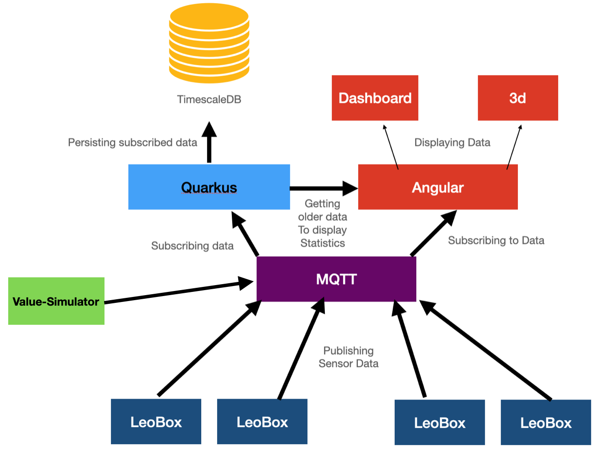

= Leo IoT
Philipp Edlinger, Quirin Ecker, Kronreif Vinzent, Felix Rieser, Florian Klausner, Simon Knogler
1.1, 2020-10-11
ifndef::sourcedir[:sourcedir: ../src/main/java]
ifndef::imagesdir[:imagesdir: images]
ifndef::backend[:backend: html5]
:icons: font

== Was war

=== Ausgangssituation
Offenes/Unvollendetes Projekt Leo-IOT.

=== Istzustand
* Fallende Luftqualität
* Konzentrationsmangel

=== Problem
* Backend veraltet
* 3D-Modell unfertig

=== Aufgabenstellung
* Umstellung des Backends auf Quarkus
* 3D Modell Optimierung
* Value Simulator um Räume zu simulieren

=== Ergebnis
* Jede Klass mit funktionierender Sensorbox ausstatten

=== Ziel
Steigerung der Lernqualität und Verbesserung des Wohlbefindens der Schüler und Lehrer

== Was ist

=== Wie weit sind wir

* Backend auf Quarkus umgestellt
* Entwicklung eines Value-Simulator nahezu fertiggestellt

=== Erster Sprint

* Endpoints updaten
* Dokumentation ergänzen
* mit Frontend starten

=== Systemarchitektur

== Was wird sein

=== Dieses Jahr

* neues Frontend
* neue Api für Verlauf der Sensor data
* Installation der Sensor Boxen
